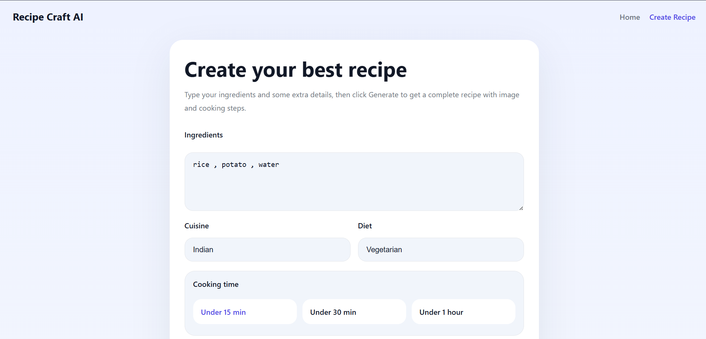
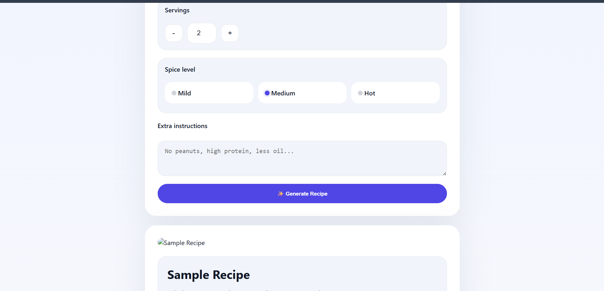
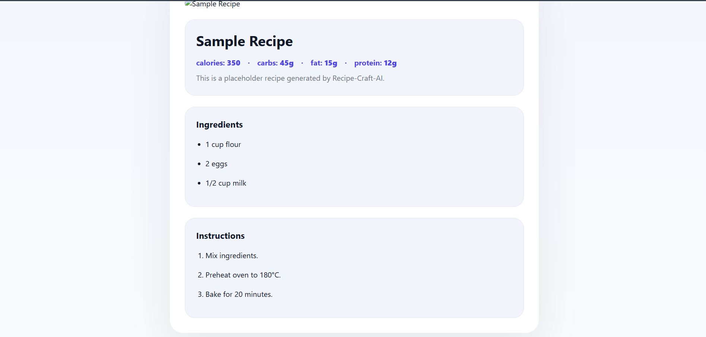
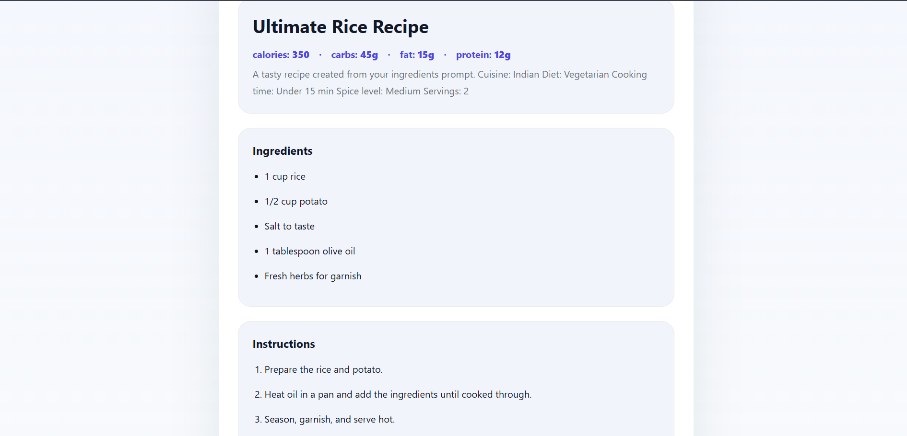

<div align="center">

# 🍳 Recipe Craft AI

### 🤖 AI-Powered Recipe Generator

Transform your everyday ingredients into delicious recipes with AI-generated cooking instructions, nutrition facts, and recipe images.

<p>
  
  
  
  
  
  
</p>

</div>

---

# 📖 Overview

Recipe Craft AI is an intelligent web application that helps users generate complete recipes using the ingredients they already have.

Users simply enter ingredients, choose their cooking preferences, and the AI creates:

- 🍽 Personalized Recipe
- 🥗 Nutrition Information
- 📋 Step-by-Step Cooking Instructions
- 🖼 AI Recipe Image
- ⏱ Cooking Time
- 🌶 Difficulty & Spice Level

---

# ✨ Features

- 🤖 AI-Powered Recipe Generation
- 🥕 Ingredient-Based Search
- 🍛 Cuisine Selection
- 🌱 Diet Preference Support
- ⏱ Cooking Time Filter
- 🥗 Nutrition Summary
- 📋 Step-by-Step Cooking Instructions
- 🖼 AI Generated Recipe Image
- ❤️ Save Favorite Recipes
- 📜 Recipe History
- 📱 Fully Responsive UI
- 🌙 Modern Clean Interface

---

# 📸 Screenshots

## 🏠 Home Page



---

## 🍳 Recipe Generator



---

## 🍽 Generated Recipe



---

## 📋 Cooking Instructions



---

# 🛠 Tech Stack

### Frontend

- HTML5
- CSS3
- JavaScript

### Backend

- Python
- Flask

### AI

- OpenAI API / Google Gemini API

### Database

- SQLite

### Deployment

- Docker
- Render

---

# 📂 Project Structure

```text
Recipe-Suggestions/
│
├── backend/
│   ├── app.py
│   ├── ai.py
│   ├── image_ai.py
│   ├── nutrition.py
│   ├── database.py
│   ├── routes.py
│   ├── models.py
│   ├── config.py
│   │
│   ├── templates/
│   │   ├── index.html
│   │   ├── recipe.html
│   │   ├── history.html
│   │   └── favorites.html
│   │
│   ├── static/
│   │   ├── css/
│   │   ├── js/
│   │   └── images/
│   │
│   └── screenshots/
│       ├── home-page.png
│       ├── generator-page.png
│       ├── generated-recipe.png
│       └── instructions.png
│
├── Dockerfile
├── docker-compose.yml
├── render.yaml
├── README.md
└── LICENSE
```

---

# 🚀 Installation

## Clone Repository

```bash
git clone https://github.com/bhaskar-tech-04/Recipe-Suggestions.git

cd Recipe-Suggestions
```

---

## Create Virtual Environment

### Windows

```bash
python -m venv .venv

.venv\Scripts\activate
```

### Linux / macOS

```bash
python3 -m venv .venv

source .venv/bin/activate
```

---

## Install Dependencies

```bash
pip install -r backend/requirements.txt
```

---

## Configure Environment Variables

Create a `.env` file inside the `backend` folder.

```env
OPENAI_API_KEY=your_openai_api_key

GEMINI_API_KEY=your_gemini_api_key
```

---

## Run the Project

```bash
cd backend

python app.py
```

Visit:

```
http://127.0.0.1:5000
```

---

# 🔄 Workflow

```text
User Enters Ingredients
          │
          ▼
Select Preferences
          │
          ▼
Flask Backend
          │
          ▼
AI Model Generates Recipe
          │
          ▼
Recipe + Image + Nutrition
          │
          ▼
Display Beautiful Recipe Card
```

---

# 🎯 Future Improvements

- 🎤 Voice Input
- 📷 Ingredient Recognition using AI Vision
- 🛒 Grocery List Generator
- 📅 Weekly Meal Planner
- ❤️ User Authentication
- ⭐ Recipe Rating System
- 🌍 Multi-language Support
- 📄 Download Recipe as PDF

---

# 🤝 Contributing

Contributions are welcome!

1. Fork this repository
2. Create your feature branch

```bash
git checkout -b feature-name
```

3. Commit your changes

```bash
git commit -m "Add new feature"
```

4. Push the branch

```bash
git push origin feature-name
```

5. Open a Pull Request

---

# 📄 License

This project is licensed under the **MIT License**.

---

# 👨‍💻 Developer

## Bhaskar Harugade

**AI & Data Science Enthusiast**

- 🔗 GitHub: https://github.com/bhaskar-tech-04
- 💼 LinkedIn: *https://www.linkedin.com/in/bhaskar-harugade-04-bhaskar/*

---

<div align="center">

### ⭐ If you like this project, please give it a Star!

Made with ❤️ using Flask, Python, HTML, CSS, JavaScript, and AI.

</div>
